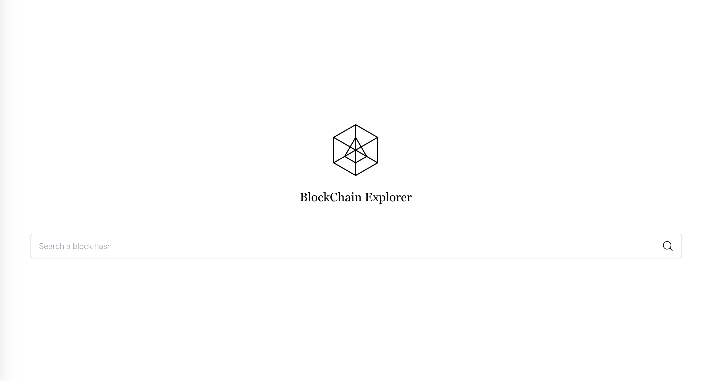

# ArcBlock Coding Test

一个简单的比特币区块查询工具，使用  [ Blockchain.com ](blockchain.com) 的 [API 接口](https://www.blockchain.com/api/blockchain_api)



## 在 ABT Node 上安装

[](https://install.arcblock.io/?action=blocklet-install&meta_url=https%3A%2F%2Fgithub.com%2Fbillyct%2Farcblock-coding-test%2Freleases%2Fdownload%2F1.0.4%2Fblocklet.json)

## 简介

* 前端使用 [Create React App](https://create-react-app.dev/)
* 后端使用 [Express](https://expressjs.com/)
* 使用 [Lerna](https://lerna.js.org/ "Lerna") 来管理整个项目

### 前端简介

* 目录在 `./packages/front`
* 使用 [Tailwind CSS](https://tailwindcss.com) 处理样式
* 使用[wouter](https://github.com/molefrog/woute) 处理应用路由
* 使用[swr](https://swr.vercel.app/) 处理数据请求的管理
* 使用 [unfetch](https://github.com/developit/unfetch) 处理简单的客户端 [GraphQL](https://graphql.org/) Query 请求，[参考](./packages/front/src/fetcher.js)

### 后端简介

* 目录在 `./packages/back`
* 这是一个简单 [GraphQL](https://graphql.org/graphql-js/running-an-express-graphql-server/) 服务
* 使用[LRU Cache](https://github.com/isaacs/node-lru-cache) 并配合文件处理做简单的持久化缓存

## 如何使用

```bash
git clone https://github.com/billyct/arcblock-coding-test.git
cd ./arcblock-coding-test

# 安装项目依赖
yarn

# 启动 http://localhost:3000
yarn start

# 运行测试
yarn test

# 编译成生产环境的代码
yarn build

# 打包成一个 blocklet
yarn bundle

# 发布到本地 abtnode
yarn deploy
```


